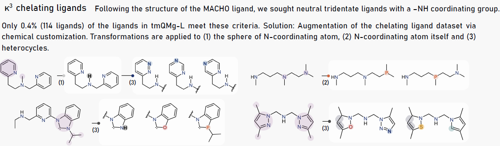
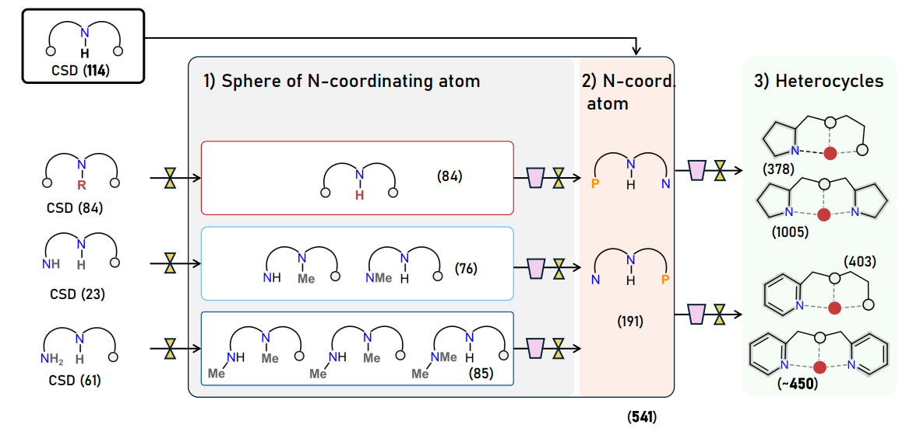
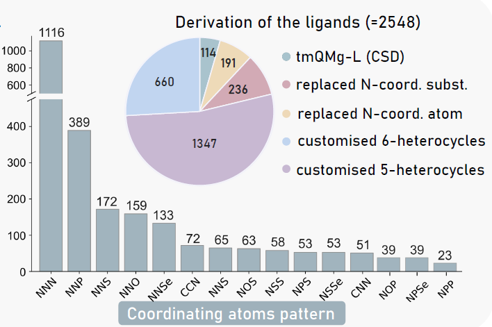

# BiFuN-L

This repository contains the data files of the ligands dataset BiFuN-L containing 2,548 ligands. The are derived from the dataset [tmQMg-L](https://github.com/uiocompcat/tmQMg-L) and from in-house modifications based on substructure prevalence in the Cambridge Structural Database.
They all contain a unique coordinating -NH group, and two more binding points. 

## Design of new ligands 

## Ligand nomenclature
Ligand names follow this format: 
<ins> tmQMg-L name​ </ins>-(N transformation, N)-(NNN→NNP, N)-(5 membered ring)-(6-membered ring)

Example:
<ins> WATDUQ-subgraph-0 </ins>-10-00-00000-00000  ​
<ins> UNIYIA-subgraph-2 <ins>-21-10-51101-61001​

Key components:
- **NH transformations depending on the number of NH groups present in the tmQMg-L ligand**:
NH=0 (1), NH>1 (2) and NH>1 and NH2!=0 (3)​

- **Number of transformations (N)**: 
Number of times this transformation is applied over the original ligand.

- **NNN to NNP transformation**:
Binary flag (0 = no transformation, 1 = applied).

-**Ring modifications**:
Transformation in **5-membered ring (-5)** or in **6-membered ring (-6)**.
Type of 5-heterocyclic ring (1, 2, 3, 4, 5, 6, 7)
Type of 6-heterocyclic ring (1, 2, 3, 4)

0 = No transformation.

## Coordinating pattern of tridentate ligands

## Data
##### [pincerligands_misc_info.csv](pincerligands_misc_info.csv)
The .csv file contains information about the IDS, SMILES, atom-coordinating pattern and metal-coordinating atom indices.

##### [electronic_opt+sp_summary.csv](electronic_opt+sp_summary.csv)
The calculated electronic descriptors for the optiimized free structures of the ligands. 

##### [rdkit_descriptors.csv](rdkit_descriptors.csv)
The calculated RDKit descriptors for the ligands. 

This is a preview package and futher content will be provided in the future.

### Authors
Lucía Morán-González - [lmoranglez](https://github.com/lmoranglez) \
David Balcells - [David-Balcells](https://github.com/David-Balcells) \
Ainara Nova 
